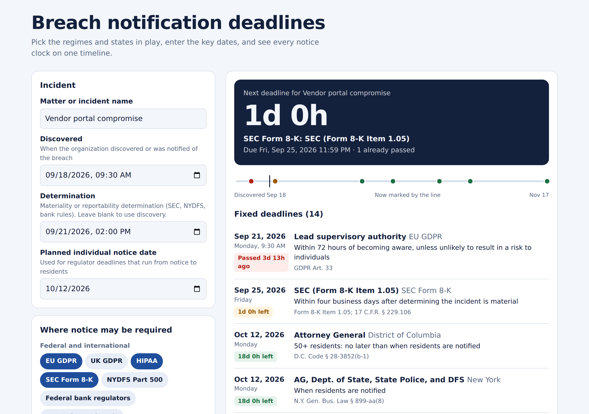

# Breach Notification Deadline Calculator

A single-file web app that puts every data breach notification clock on one timeline. Enter the discovery date, pick the regimes and states in play, add affected counts, and it shows each deadline with a live countdown, the recipient, the rule, and the citation.



## Features

- **Live countdown** to the next deadline, plus a timeline of every deadline from discovery onward
- **Fixed deadlines** sorted by due date and color-coded: passed, due within 7 days, or on track
- **"No fixed day count" list** for obligations like "without unreasonable delay," kept separate so they aren't overlooked
- **Threshold handling.** Enter affected counts to show or hide AG, regulator, media, and consumer reporting agency notices. If a count is blank, threshold-based notices are shown and marked as conditional.
- **One-click selection** of all 50 states plus DC, and one count applied to every selected state
- **Copy summary** as plain text for email or a matter file, and a print-friendly layout
- **Works offline and keeps data local.** Inputs are saved only in the user's own browser storage, and nothing is sent to a server.

## Coverage

**Federal and international:** EU GDPR, UK GDPR, HIPAA, SEC Form 8-K Item 1.05, NYDFS Part 500, federal bank regulators (36-hour rule), FTC Safeguards Rule, FTC Health Breach Notification Rule, and DFARS 252.204-7012.

**States:** The general breach notification statutes of all 50 states and the District of Columbia, including recent amendments such as California's 30-day individual notice rule and Oklahoma's new AG notice requirement (both effective January 1, 2026).

**Not covered:** U.S. territories, sector-specific state rules (such as insurance data security laws), contractual notice obligations, and non-U.S. laws other than the EU and UK GDPR.

## Usage

1. Open `index.html` in any modern browser, or visit the GitHub Pages site.
2. Enter the **discovery** date and time. Optionally add a **determination** date (used by the SEC, NYDFS, and bank rules) and a **planned individual notice date** (used by regulator deadlines that run from notice to residents).
3. Select the federal regimes and states that apply, or use **Add all states**.
4. Enter the number of affected people for each selection, or use **Same count for every selected state**. State counts should be residents of that state, not the total breach size.
5. Review the deadlines, then use **Copy summary** or **Print**.

## How deadlines are calculated

- Times are shown in the device's local time zone.
- The discovery date is day zero. Day-based deadlines fall at 11:59 PM on the final day.
- Hour-based deadlines (GDPR, NYDFS, bank regulators, DFARS) run from the exact time entered.
- Business-day deadlines (SEC, Vermont, Iowa) skip weekends and U.S. federal holidays, including observed dates.
- Deadlines that run from individual notice use the planned notice date if one is entered. Otherwise they use the latest permitted individual notice date.
- Law-enforcement delays, tolling, and extensions are **not** applied.

## Deploying with GitHub Pages

1. Put `index.html`, `README.md`, and `screenshot.png` in the root of the repository.
2. Go to **Settings → Pages**, set the source to **Deploy from a branch**, and choose `main` and `/ (root)`.
3. The site will be published at `https://<username>.github.io/<repository>/`.

The app has no build step or dependencies. It loads the Public Sans font from Google Fonts and falls back to system fonts if that request is blocked.

## Updating the rules

All legal rules are in the `RULES` array near the top of the `<script>` section in `index.html`. Each jurisdiction looks like this:

```js
{id:'TX', g:'state', name:'Texas', items:[
  {to:'Individuals', n:60, u:'d', f:'disc', t:'Rule text', c:'Citation'},
  {to:'Attorney General', n:30, u:'d', f:'disc', min:250, t:'Rule text', c:'Citation'}
]}
```

| Field | Meaning |
|---|---|
| `id` | Short code (state abbreviations appear on the chips) |
| `g` | Group: `fed` (federal and international) or `state` |
| `to` | Who must be notified |
| `n` | Amount of time. Omit it for obligations with no fixed day count |
| `u` | Unit: `h` hours, `d` calendar days, `bd` business days |
| `f` | Starting point: `disc` discovery, `det` determination, `indiv` individual notice, `ye` end of the calendar year of discovery |
| `min` / `max` | Affected-count thresholds that trigger the notice (inclusive) |
| `t` | Plain-language description of the rule |
| `c` | Citation |

## Disclaimer

This tool supports legal analysis and does not replace it. The rules were current as of September 2026 but may have changed. Confirm every deadline against the governing statute, regulation, and any applicable guidance before relying on it. Nothing here is legal advice.
